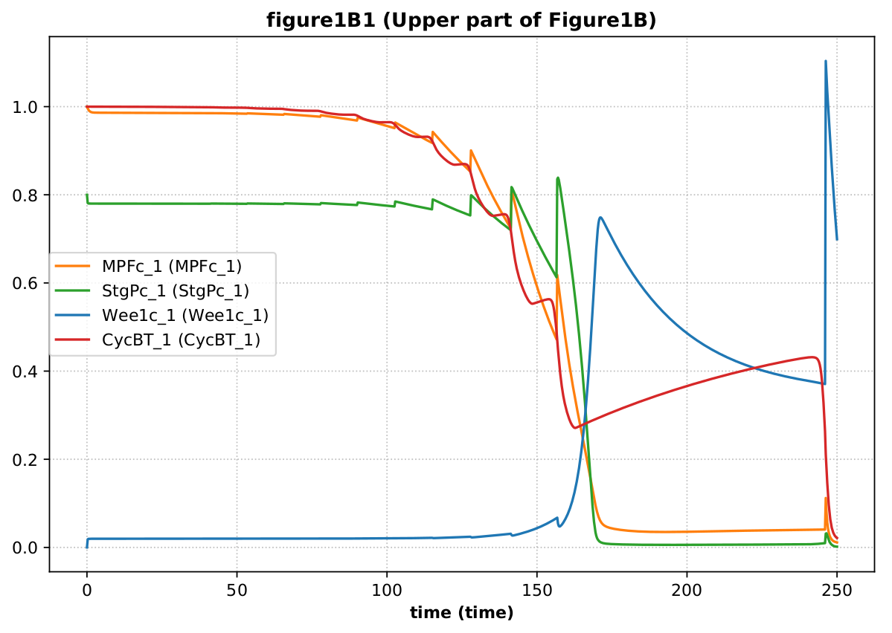
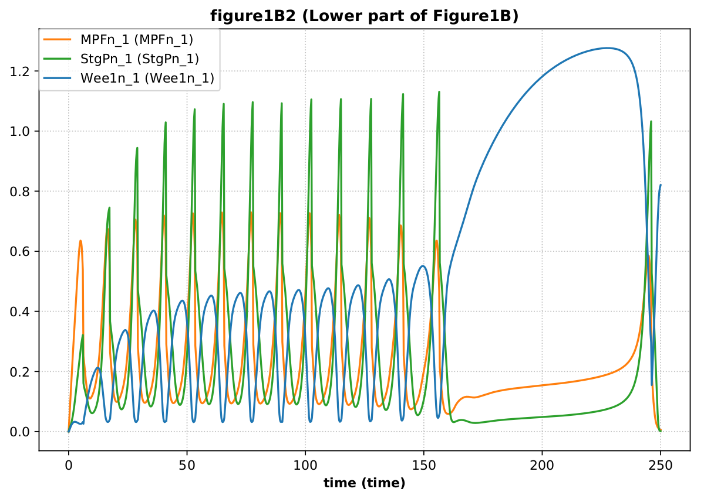

# tellurium-cas
This repository demonstrates how to run the [CombineArchiveShowCase](https://github.com/SemsProject/CombineArchiveShowCase)
with [tellurium](http://tellurium.analogmachine.org/).

The results of the archive execution are available in
[./tellurium-cas.ipynb](./tellurium-cas.ipynb)
and the output folder
[./results/output](./results/output)

## Running the CombineShowCase archive
Clone the repository
```
git clone https://github.com/matthiaskoenig/tellurium-cas.git
cd tellurium-cas
```
Create a python virtual environment with [tellurium](http://tellurium.analogmachine.org/)
```
mkvirtualenv tellurium-cas
(tellurium-cas) pip install -r requirements.txt
```
Register kernel & run jupyter notebook 
```
(tellurium-cas) python -m ipykernel install --user --name=tellurium-cas
(tellurium-cas) jupyter notebook tellurium-cas.ipynb
```

Run the notebook
```
Kernel -> Change Kernel -> tellurium-cas
Kernel -> Restart & Run All
```


